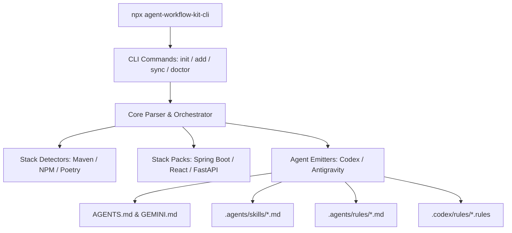

<p align="center">
  
</p>

<h1 align="center">agent-workflow-kit-cli</h1>

<p align="center">
  <strong>A Repo-First AI Workflow Generator & Guideline Optimizer for Codex and Antigravity</strong>
</p>

<p align="center">
  <a href="https://github.com/TruongTXK18FPT/agent-workflow-kit-cli">
    
  </a>
  <a href="https://github.com/TruongTXK18FPT/agent-workflow-kit-cli/stargazers">
    
  </a>
  <a href="https://github.com/TruongTXK18FPT/agent-workflow-kit-cli/issues">
    
  </a>
</p>

---

## 📖 Introduction

`agent-workflow-kit-cli` is an open-source, CLI-driven **repo-first workflow package generator** built specifically for software development teams utilizing AI coding agents like **OpenAI Codex** and **Google Antigravity**. 

Rather than relying on model fine-tuning or heavy ad-hoc prompting, this kit allows you to generate standardized coding structures, workspace rule-bases, custom skill files, and automated testing validations directly inside your repository. By placing machine-readable instructions directly in your repository layout (`AGENTS.md`, `.agents/skills`, `.agents/rules`), AI agents are instantly aligned with your technology stacks, architecture principles, formatting conventions, and done criteria from their very first command.

---

## ⚡ Key Features

- **Automatic Stack Detection:** Scans repository manifests (`pom.xml`, `package.json`, `pyproject.toml`) to automatically configure directory architectures and templates.
- **Unified Multi-Agent Compatibility:** Seamlessly generates standard instructions compatible with both Codex (`AGENTS.md`) and Antigravity (`GEMINI.md`).
- **Standardized Skills & Rules:** Auto-emits persistent agent skills (slash command extensions) and syntax/lint constraints.
- **Opinionated Architectural Presets:** Encourages clean-ish, modular layouts (e.g. `feature-first` structure) that minimize AI token consumption and narrow down execution context.
- **Verification Hook Validation:** Integrates with local toolchains (Maven verify, Vitest, Ruff, pytest, Checkstyle, Spotless) to verify agent edits before commits.

---

## 🏗️ Core Architecture

The kit is structured around a decoupled pipelines approach to separate stack logic from specific agent formats.



### Module Structure

- **`src/cli/`**: Parses commands and argument settings via Commander.
- **`src/core/`**: Controls code generation flow, schemas, file merges, and dry-run comparisons.
- **`src/detectors/`**: Identifies local build configurations and monorepos.
- **`src/presets/`**: Manages default templates for architectural designs, styles, linters, tests, and CI/CD pipelines.
- **`src/packs/`**: Holds modular logic packs for Spring Boot, React + TS, and FastAPI.
- **`src/emitters/`**: Translates templates into target markdown configs.
- **`templates/`**: Multi-language Handlebars templates.

---

## 📦 Supported Stack Packs & Workflows

### ☕ Java Spring Boot Pack
Designed for robust enterprise backend environments.
- **Default Architecture:** Feature-first modular packages containing inner layers (dto, entity, repository, mapper, service, web).
- **Tooling Defaults:** Checkstyle (coding formatting), Spotless (auto-format validation), Maven compiler (Java 17+).
- **Test Slices:** Service Unit Tests, Web Controllers (`@WebMvcTest`), JPA repositories (`@DataJpaTest`).

#### Spring Boot Folder Structure Example:
```text
src/main/java/com/acme/app/
  customer/
    dto/
      CreateCustomerRequest.java
      CustomerResponse.java
    entity/
      Customer.java
    mapper/
      CustomerMapper.java
    repository/
      CustomerRepository.java
    service/
      CustomerService.java
      impl/CustomerServiceImpl.java
    web/
      CustomerController.java
```

---

### ⚛️ React + TypeScript Pack
Tailored for scalable component-driven frontend developments.
- **Default Architecture:** Feature-first modules with localized state hooks, routing wrappers, and style files.
- **Tooling Defaults:** Vite (bundler), TypeScript Strict Compiler Settings, ESLint Flat Config, Prettier.
- **Test Slices:** React Testing Library + Vitest + jest-dom.

#### React + TypeScript Configs:
```ts
// eslint.config.mjs
import js from "@eslint/js";
import tseslint from "typescript-eslint";

export default tseslint.config(
  js.configs.recommended,
  ...tseslint.configs.recommended,
  {
    files: ["src/**/*.{ts,tsx}"],
    rules: {
      "@typescript-eslint/no-explicit-any": "error",
      "@typescript-eslint/consistent-type-imports": "error",
    },
  }
);
```

---

### 🐍 Python FastAPI Pack
Optimized for high-performance python API layers.
- **Default Architecture:** Feature router packages with localized schema, service, and database models.
- **Tooling Defaults:** Ruff (extremely fast Python linter & formatter), mypy (strict type-checking), Python 3.11+.
- **Test Slices:** Pytest + TestClient (HTTPX).

#### FastAPI Configuration:
```toml
# pyproject.toml
[tool.ruff]
line-length = 100

[tool.ruff.lint]
select = ["E", "F", "I", "B", "UP"]

[tool.mypy]
python_version = "3.11"
strict = true
packages = ["src"]
```

---

## 🛠️ CLI Reference

Install and initialize the toolkit instantly inside any project workspace using `npx`:

```bash
npx agent-workflow-kit-cli init [options]
```

### Emitters Options Table

| Option | Values | Default | Description |
|---|---|---|---|
| `--stack` | `auto`, `spring-boot`, `react-ts`, `fastapi` | `auto` | Choose target framework or let the detector auto-resolve. |
| `--agent` | `both`, `codex`, `antigravity` | `both` | Target agent formatting profiles. |
| `--dry-run` | Boolean | `false` | Outputs the plan to safe console output without writing files. |

### Command Commands Suite

- **`init`**: Analyzes the directory and bootstraps workflow rules.
- **`sync`**: Re-evaluates configuration manifests and updates generated documentation segments without touching user modifications.
- **`doctor`**: Checks consistency of active configurations, formatting states, and verification command integrity.

---

## 🤖 Agent Integration Details

### Shared Directives Layer (`AGENTS.md`)
Placed in the workspace root, `AGENTS.md` is automatically ingested at the beginning of the agent session. It sets expectations for file naming, layering constraints, package manager usage, and completion checklists.

### Slash-Command Skills (`.agents/skills/`)
Custom agent capabilities are placed inside `.agents/skills/<skill-name>/SKILL.md`. Both Codex and Antigravity ingest these to expose custom workflows invoked via commands (like `/spring-feature` or `/react-route`).

#### Typical `SKILL.md` Example:
```md
---
name: react-feature
description: Generates custom React component hooks and routes
---
Inputs:
- component name
- target path

Steps:
1. Examine neighboring route components
2. Create types.ts contract
3. Implement hooks and main UI components
4. Run validation checks: npm run lint && npm run build
```

### Antigravity-Specific Constraints (`.agents/rules/`)
Google Antigravity rules are written as Markdown documents in `.agents/rules/*.md`.
> [!IMPORTANT]
> Antigravity enforces a strict limit of **12,000 characters** per rule file. Keep generated rules thin and refer to external documents like `@AGENTS.md` to avoid truncations.

---

## 🧪 Development & Testing

We maintain a rigorous pipeline to test changes made to this CLI toolkit.

### Local Setup
Ensure you have Node.js 20+ installed. Clone the repository and install dependencies:
```bash
git clone https://github.com/TruongTXK18FPT/agent-workflow-kit-cli.git
cd agent-workflow-kit-cli
npm install
```

### Running Tests
We use **Vitest** for testing:
- **Unit Tests:** Validates manifest detectors and template parsing.
- **Fixture Tests:** Performs snapshot checks against baseline directories to check for file output drifts.

```bash
# Run all vitest suites
npm test
```

---

## ⚖️ License

Distributed under the Apache-2.0 License. See `LICENSE` for more details.

---

<p align="center">
  For more details, issues, and feature requests, visit the official repository:
  <br />
  <strong><a href="https://github.com/TruongTXK18FPT/agent-workflow-kit-cli">https://github.com/TruongTXK18FPT/agent-workflow-kit-cli</a></strong>
</p>
